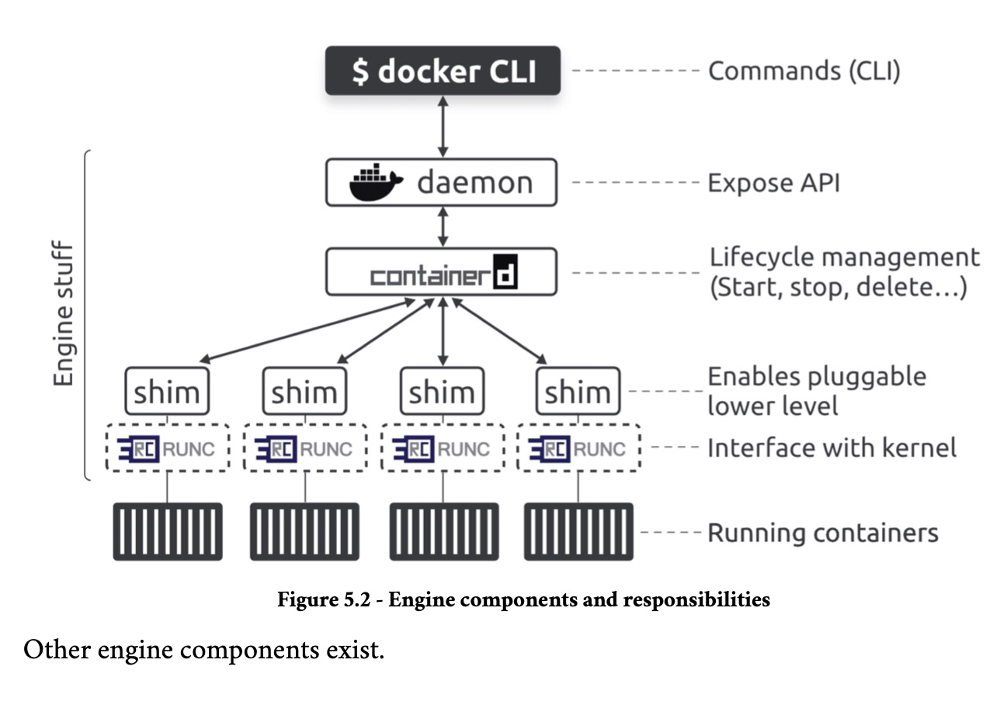
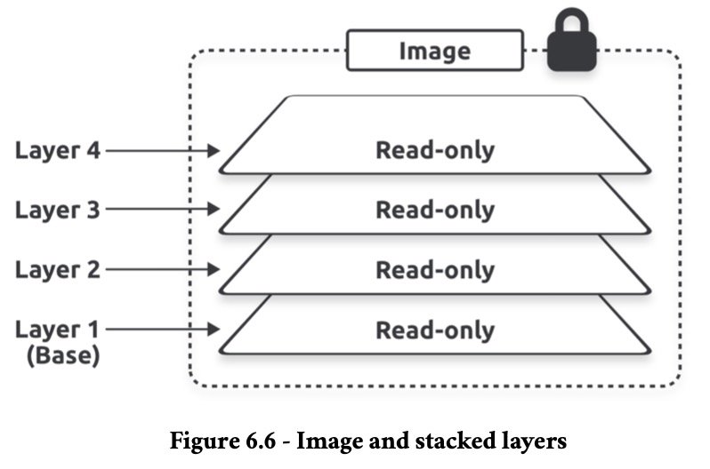
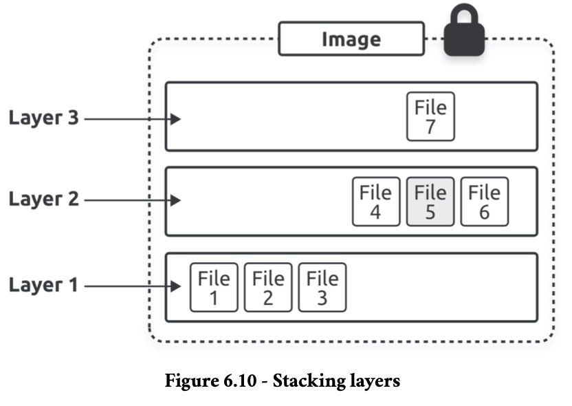
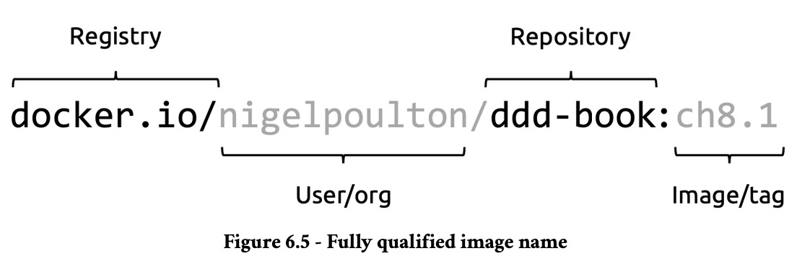
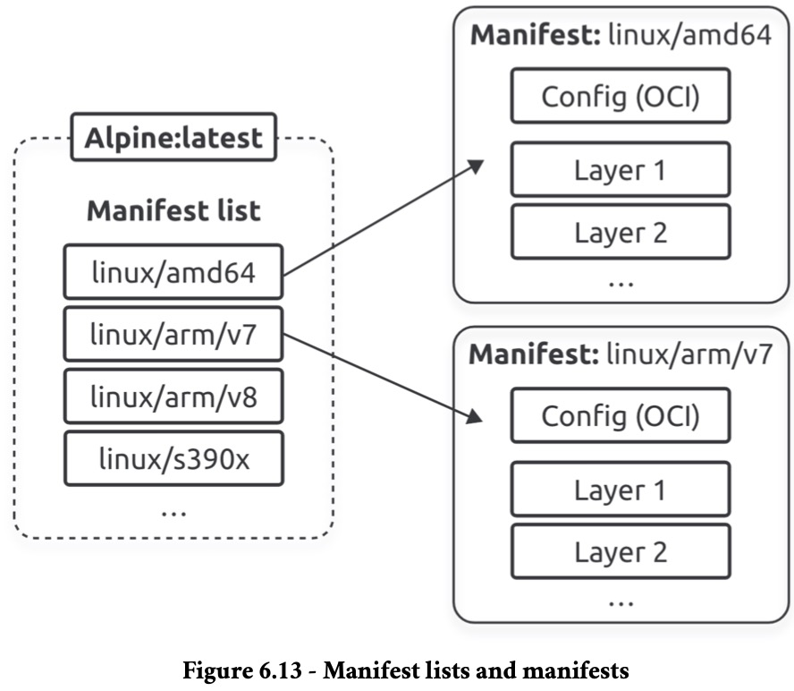
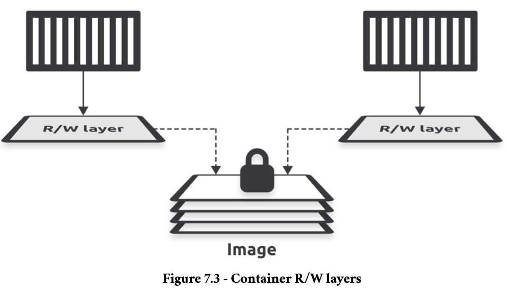
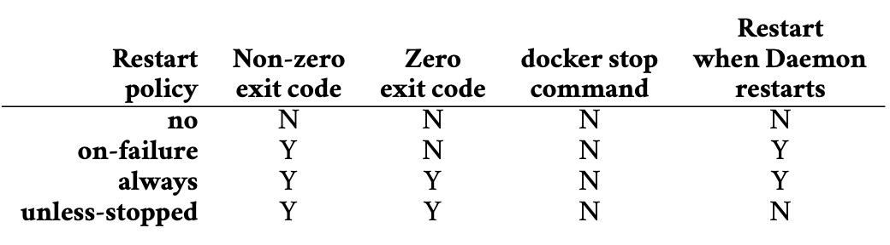
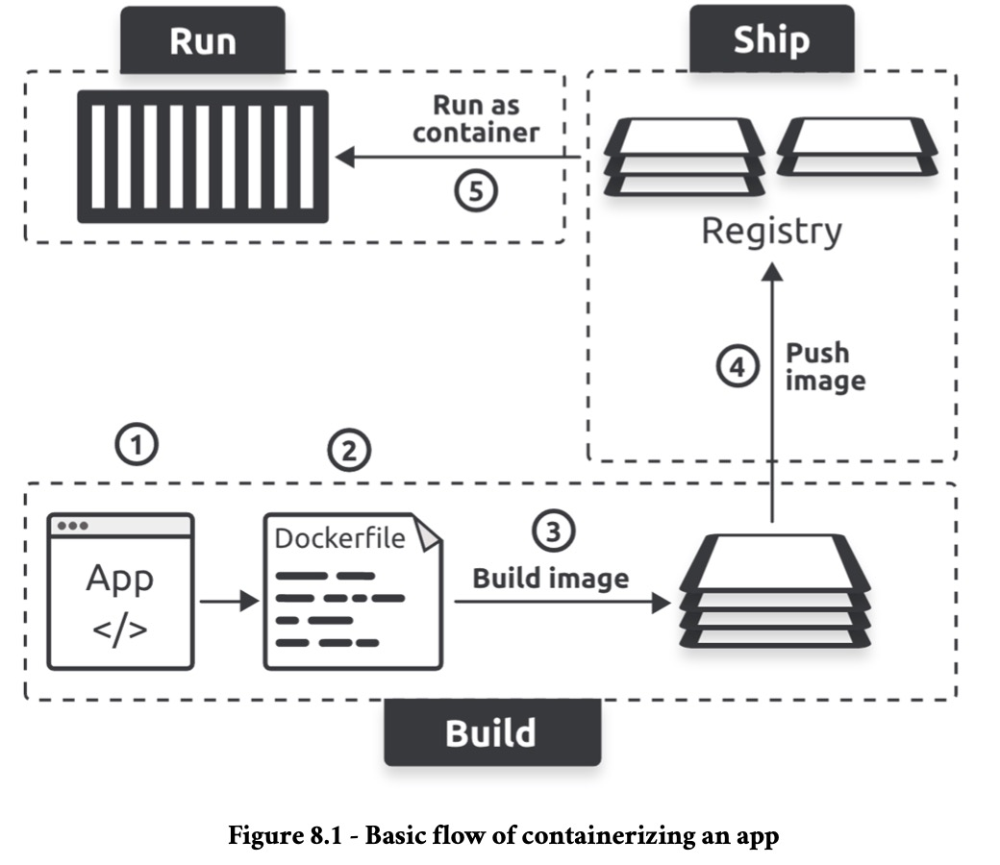

# Notes on Docker

## Server Side

The Docker Engine is modular and built from many small specialized components pulled from projects such as the OCI, the CNCF, and the Moby project.



### runc

`runc` is the reference implementation of the OCI runtime-spec. It is a lightweight CLI wrapper for `libcontainer` that you can download and use to manage OCI-compliant containers. However, it’s a very low-level tool and lacks almost all of the features and add-ons you get with the Docker Engine. It is said that `runc` operates at the OCI layer, and we often refer to it as a low-level runtime.

Docker and Kubernetes both use `runc` as their default low-level runtime, and both pair it with the `containerd` high-level runtime:

- `containerd` operates as the high-level runtime managing lifecycle events;
- `runc` operates as the low-level runtime executing lifecycle events by interfacing with the kernel to do the work of actually building containers and deleting them.

### containerd

`containerd` as a high-level runtime as it manages lifecycle events such as starting, stopping, and deleting containers. However, it needs a low-level runtime to perform the actual work. Most of the time, `containerd` is paired with `runc` as its low-level runtime. However, it uses shims that make it possible to replace `runc` with other low-level runtimes. It has grown to include the ability to also manage images, networks, and volumes.

### Example Workflow

When you run `docker run -d --name ctr1 nginx`, the Docker client converts them into API requests and sends them to the API exposed by the daemon. The daemon can expose the API on a local socket or over the network. On Linux, the local socket is `/var/run/docker.sock` and on Windows it’s `\pipe\docker_engine`. The daemon receives the request, interprets it as a request to create a new container, and passes it to `containerd`. The daemon communicates with containerd via a CRUD-style API over `gRPC` . Despite its name, even `containerd` cannot create containers. It converts the required Docker image into an OCI bundle and tells `runc` to use this to create a new container. `runc` interfaces with the OS kernel to pull together all the constructs necessary to create a container (namespaces, cgroups, etc.). The container starts as a child process of `runc`, and as soon as the container starts, `runc` exits.

### Shims

Shims are a popular software engineering pattern, and the Docker Engine uses them in between containerd and the OCI layer, bringing the following benefits:

- Daemonless containers;
- Improved efficiency;
- Pluggable OCI layer.

Daemonless containers is the ability to stop, restart, and even update the Docker daemon without impacting running containers. On the efficiency front, `containerd` forks a shim and a `runc` process for every new container. However, each `runc` process exits as soon as the container starts running, leaving the shim process as the container’s parent process. The shim is lightweight and sits between `containerd` and the container. It reports on the container’s status and performs low-level tasks such as keeping the container’s STDIN and STDOUT streams open. Shims also make it possible to replace `runc` with other low-level runtimes.

## Client Side

### Management Commands

- `builder` and `buildx`:     Manage builds with extended capabilities through BuildKit;
- `compose`:                  Define and run multi-container applications with Docker;
- `container`:                Manage containers, such as copying files between a container and the local filesystem;
- `context`:                  Manage contexts, such as creating, exporting and listing them;
- `image`:                    Manage images, such as building, listing and importing them;
- `manifest`:                 Manage Docker image manifests and manifest lists, such as creating and inspecting it;
- `network`:                  Manage networks, such as connecting a container to a network or creating it;
- `plugin`:                   Manage plugins, such as creating, enabling and installing it;
- `system`:                   Manage Docker itself, such as showing disk usage and pruning used space;
- `trust`:                    Manage trust on Docker images, such as inspecting keys and signers of images;
- `volume`:                   Manage volumes, such as creating, listing and pruning them.

## Images

An image is a read-only package containing everything needed to run an application. This means they include application code, dependencies, a minimal set of OS constructs, and metadata. Multiple containers can be started from a single image. As such, images are build-time constructs, whereas containers are run-time constructs.

Docker creates images by stacking independent layers and representing them as a single unified object. One layer might have the OS components, another layer might have application dependencies, and another layer might have the application.

The `docker container run` command is the most common way to start a container from an image. Once the container is running, the image and the container are bound, and you cannot delete the image until you stop and delete the container. If multiple containers use the same image, you can only delete the image after you’ve deleted all the containers using it.

`docker inspect registry/user/repository:tag` can be used to gather information about an image, like seeing if it has an `Entrypoint`:

```bash
docker inspect nigelpoulton/ddd-book:web0.1 | grep Entrypoint -A 3

# "Entrypoint": [
#     "node",
#     "./app.js"
# ],
```

### Pulling

_Local repository_ is jargon for an area on your local machine where Docker stores images for more convenient access. We sometimes call it the image cache, and on Linux it’s usually located in `/var/lib/docker/<storage-driver>`.

`docker image pull name` pulls image `name` layer by layer. If not set, it always assumes the latest tag and pulls from Docker Hub. Docker only pulls the layers that are not already downloaded because layers can be shared between images.



One makes changes to images by stacking new layers on top of old ones, containing updated files.



Here, file 7 updated file 5.

One can also pull an image by its digest. A digest is the hash of an image content, so it's more reliable than tags to ensure unicity.

To find out the digest of an image:

```bash
docker buildx imagetools inspect registry/user/repository:tag
```

To pull using the digest:

```bash
docker pull registry/user/repository@sha256:13dd59a0
```

It’s also possible to directly query the registry API for image data, including digest:

```bash
curl "https://hub.docker.com/v2/repositories/nigelpoulton/k8sbook/tags/?name=latest" | jq '.results[].digest'

# "sha256:13dd59a0c74e9a147800039b1ff4d61201375c008b96a29c5bd17244bce2e14b"
```

An image is just a manifest file with some metadata and a list of layers. The actual application and all its dependencies live in the layers that are fully independent and have no concept of being part of an image. As such:

- Images digests are a crypto hash of the image’s manifest file
- Layer digests are a crypto hash of the layer’s contents

Docker compares hashes before and after every push and pull to ensure no tampering occurs while data is crossing the network.

`docker rmi <image>:<tag>`  or `docker image rm <image>:<tag>` will delete an image from a local repository.

### Registries

Registries that implement the OCI distribution-spec are called OCI registries. Image registries contain one or more image repositories, and image repositories contain one or more images. The default registry is Docker Hub, but others exist, including 3rd-party internet-based registries and secure on-premises registries.

Image names are written like so:



To be pulled with `docker image pull <registry>/<user>/<repository>:<tag>`.

### Manifests

The manifest list is a list of architectures supported by an image tag. Each supported architecture then has its own manifest that lists the layers used to build it. `docker buildx imagetools inspect` can be used to see it.



## Containers

Containers are run-time instances of images, and one or more containers can be started from a single image. They’re designed to be stateless, immutable and ephemeral. Containers should only run a single process.

The image of a container is read-only, but each container is read-write. each container has its own thin R/W layer but shares the same image. The containers can see and access the files and apps in the image through their own R/W layer, and if they make any changes, these get written to their R/W layer. When you stop a container, Docker keeps the R/W layer and restores it when you restart the container. However, when you delete a container, Docker deletes its R/W layer. This way, each container can make and keep its own changes without requiring write access to the shared image.



### Running

A container can be run like so:

```bash
docker run --rm -d alpine sleep 60
```

This starts a new background container based on the Alpine image and tells it to run the `sleep 60` command, causing it to run for 60 seconds and then exit. The `--rm` flag cleans up the exited container so it doesn`t have to be deleted manually.

One can start an interactive `exec` session on a running container like so:

```bash
docker exec -it name sh
```

Removing the `-it` option makes the execution remote.

Most containers only run a single process. This is the container’s main app process and is always PID 1. If the container’s main process (PID 1) is killed, the container will also be.

`docker inspect` can provide information about running containers.

`docker container ls` or `docker ps` shows the running containers on the host.

`docker container rm <name>`, `docker container stop <name>` and `docker container restart <name>` removes, stops and restarts the container.

`docker container attach <name>` will connect STD{IN,OUT,ERR} to the running container.

### Self-Healing

Container restart policies are a simple form of self-healing that allows the local Docker Engine to automatically restart failed containers. The policies are: `no`, `on-failure`, `always` and `unless-stopped`:



The policy is defined as option `--restart <policy>` to `docker run`.

### App Containerization



1. Write your application and create a list of dependencies
2. Create a Dockerfile that tells Docker how to build and run the app
3. Build the app into an image
4. Push the image to a registry (optional)
5. Run a container from the image

__(2)__ is done by writting a Dockerfile. Comments are done with `#`. All non-comment lines are called instructions or steps and take the format `<INSTRUCTION> <arguments>`. Some instructions create new layers, whereas others add metadata. Examples of instructions that create new layers are `FROM`, `RUN`, `COPY` and `WORKDIR`. Examples that create metadata include `EXPOSE`, `ENV`, `CMD`, and `ENTRYPOINT`. The premise is this:

- Instructions that add content, such as files and programs, create new layers
- Instructions that don’t add content don’t add layers and only create metadata

`docker history <image>` shows the steps that created it. Lines with a non-zero value in the `SIZE` column created new layers, whereas the lines with 0B only added metadata.

__(3)__ is done by running `docker build -t <name>:<tag> -f <Dockerfile Path> .`, where `.` is the path to the _build context_ (where the app files live). The final number of layers is the sum of all Dockerfile commands that created layers plus the number of layers of the base image.

__(4)__ is done by running `docker login` to login to Docker Hub and then running `docker push <repository>/<name>:<tag>`. Re-tag the image with `docker tag <current-tag> <new-tag>` if the name of the image doesn't follow `<repository>/<name>:<tag>`.

__(5)__ is done through `docker run`.

### Multi-Stage Builds

Multi-stage builds use a single Dockerfile with multiple `FROM` instructions — each `FROM` instruction represents a new build stage. This allows one to have a stage where one does the heavy lifting of building the app inside a large image with compilers and other build tools, but then you have another stage where you copy the compiled app into a slim image for production. The builder can even run different stages in parallel for faster builds. Example:

```Dockerfile
# Stage 0
FROM golang:1.23.4-alpine AS base
WORKDIR /src
COPY go.mod go.sum .
RUN go mod download
COPY . .

# Stage 1
FROM base AS build-client
RUN go build -o /bin/client ./cmd/client

# Stage 2
FROM base AS build-server
RUN go build -o /bin/server ./cmd/server

# Stage 3
FROM scratch AS prod
COPY --from=build-client /bin/client /bin/
COPY --from=build-server /bin/server /bin/
ENTRYPOINT [ "/bin/server" ]
```

Each stage outputs an intermediate image that later stages can use. However, Docker deletes them when the final stage completes. The builder will run the `base` stage first, then run the `build-client` and `build-server` stages in parallel, and finally run the `prod` stage. The goal of the `base` stage is to create a reusable build image with all the tools stages 1 and 2 need to build the client and server applications. The `build-client` and `build-server` stages don’t pull a new image. Instead, they use the `FROM base AS build-client` and `FROM base AS build-server` instruction to use the intermediate image created by the `base` stage. `prod` will have only 2 layers because of the two `COPY` steps.

The `prod` stage could be divided in two like so:

```Dockerfile
# Stage 0
FROM golang:1.23.4-alpine AS base
WORKDIR /src
COPY go.mod go.sum .
RUN go mod download
COPY . .

# Stage 1
FROM base AS build-client
RUN go build -o /bin/client ./cmd/client

# Stage 2
FROM base AS build-server
RUN go build -o /bin/server ./cmd/server

# Stage 3
FROM scratch AS prod-client
COPY --from=build-client /bin/client /bin/
ENTRYPOINT [ "/bin/client" ]

# Stage 4
FROM scratch AS prod-server
COPY --from=build-server /bin/server /bin/
ENTRYPOINT [ "/bin/server" ]
```

On this case, it's necessary to tell `docker build` the target: `--target prod-server` or `--target prod-client`.

Behind the scenes, Docker’s build system has a client (`Buildx`) and server (`BuildKit`). You can configure `Buildx` to talk to multiple `BuildKit` instances, and we call each instance of `BuildKit` a builder. Builders can run on your local machine, in your cloud or datacenter, or Docker’s Build Cloud (paid).

When you run a `docker build` command, `buildx` interprets the command and sends the build request to the selected builder through a driver. This includes the Dockerfile, command line arguments, caching options, export options, and the build context (app and dependency list). The builder performs the build and exports the image. The `Buildx` client monitors the build and reports on progress. The driver is `docker-container` for local builds and `cloud` for remote builds.

`docker buildx ls` lists the available builders. The one with the asterisk (*) is the default builder.

`docker buildx create --driver=docker-container --name=container` creates a new builder called `container` that uses the `docker-container` driver.

`docker buildx use container` makes it the default.

`docker buildx build --builder=container --platform=linux/amd64,linux/arm64 -t repository/name:tag --push .` builds the image for x86 and ARM and pushes it to Docker Hub using the previously created builder. Use `--load` instead of `--push` to not publish the image.

## Docker Model Runner

TODO

## Networking

TODO

## Volumes

TODO

## Security

TODO
