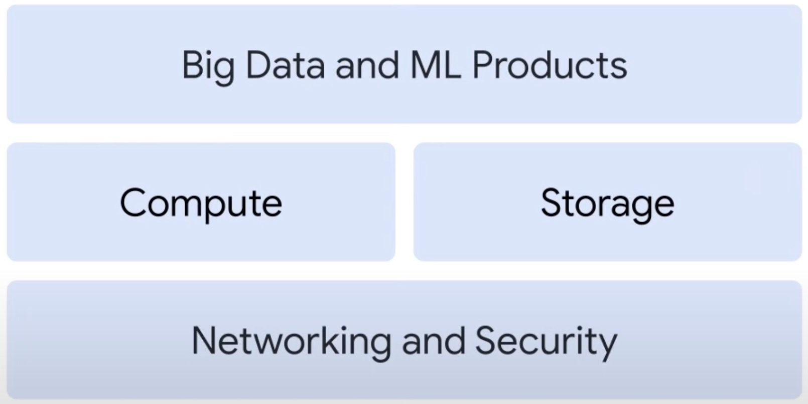
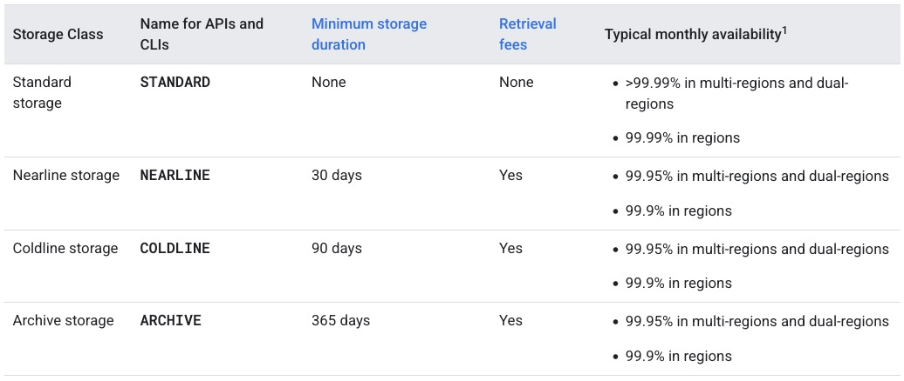

# Notes on GCP

## GCP Infrastructure

Google Cloud infrastructure exists in 3 layers:



And is based on 5 locations: North America, South America, Europe, Asia and Australia. Each location is subdivided into regions and each region into zones. Example: `europe-west2` is a region inside location Europe and is subdivided into zones a, b and c. A zonal resource is deployed into a specific zone.

*Resources* are hierarchical: the top level is the organization, which can contain multiple folders, which can contain multiple projects which can contain multiple resources. Projects can have different owners and users and are billed separately. The `Resource Manager` is the service that manages projects. A project has 3 attributes:

- `ID`: globally unique, assigned by GCP and immutable
- `Name`: not unique, chosen by user and mutable
- `Number`: globally unique, assigned by GCP and immutable

*Billing* accounts can be linked to multiple projects and are charged automatically every month or over a threshold. Budgets, alerts, reports and quotas can be used to fine tune billing. Quotas can be `rate` or `allocation`, depending if it resets after some time or after some resource number limit.

## Compute

Compute in GCP can be:

- `Compute Engine`: IaaS, VM service
- `Kubernetes Engine`: Hybrid, managed k8s service
- `App Engine`: PaaS, zero ops platform for high available apps
- `Cloud Run`: Serverless, deploy containerized apps
- `Cloud Run Function`: Serverless, execution environment

*Compute Engine* bills by the second with a one-minute minimum, and sustained-use discounts start to apply automatically to virtual machines the longer they run. It also offers committed-use discounts that means that for stable and predictable workloads, a specific amount of vCPUs and memory can be purchased for up to a 57% discount off normal prices in return for committing to a usage term of one year or three years. There are also preemptible VMs, which are different from an ordinary VM in only one respect: Compute Engine has permission to terminate a job if its resources are needed elsewhere. While savings are possible with preemptible VMs, you'll need to ensure that your job can be stopped and restarted.

*Compute Engine* has a feature called autoscaling, where VMs can be added to or subtracted from an application based on load metrics. The other part of making that work is balancing the incoming traffic among the VMs. Google's Virtual Private Cloud, or VPC, supports several different kinds of load balancing.

*App Engine* is a platform to deploy apps disregarding the underlying infrastructure. For the languages supported, GCP will deal with scaling. App Engine also provides built-in services and APIs, like NoSQL datastores, Memcache, load balancing, health checks, application logging, and a user authentication API that is common to most applications. There are two types of App Engine environments: standard and flexible. Standard is based on container instances running on Google's infrastructure. Containers are preconfigured with a runtime from a standardized list of supported languages and versions, which include libraries that support App Engine standard APIs. It also includes:

- Persistent storage with queries, sorting, and transactions.
- Automatic scaling and load balancing.
- Asynchronous task queues for performing work outside the scope of a request.
- Scheduled tasks for triggering events at specified times or regular intervals.
- Integration with other Google Cloud services and APIs

But it requires:

- Use of a specified versions of Java, Python, PHP, Go, Node.js, and Ruby.
- The application must conform to sandbox constraints that are dependent on runtime.

The workflow is typically this:

- A web application is developed and tested locally.
- The SDK is used to deploy the application to App Engine.
- App Engine scales and services the application.

The flexible environment can let you specify the type of container your web application will run in. This option lets an application run inside Docker containers on Google Cloud’s Compute Engine virtual machines. In this case, App Engine manages Compute Engine machines for you. This means that:

- Instances are health-checked, healed as necessary, and colocated with other module instances within the project.
- Critical, backward-compatible updates are automatically applied to the underlying operating system.
- VM instances are automatically located by geographical region according to the settings in your project.
- Google's management services ensure that all of a project's VM instances are colocated for optimal performance.
- VM instances are restarted on a weekly basis, when Google's management services will apply any necessary operating system and security updates.

Comparison:

- The standard environment starts up instances of your application in seconds, but you have less access to the infrastructure in which your application runs. The flexible environment takes minutes to start up, instead.
- With the standard environment, you can’t use ssh to connect to the virtual machines on which your application runs, and you can’t write to a local disk, the flexible can.
- The standard environment does support third-party binaries for certain languages, and you can use App Engine to make calls to the network.

*Cloud Run Functions* is a serverless code that lets you run it based on certain events. It is a lightweight, event based, asynchronous compute solution that allows you to create small, single purpose functions that respond to cloud events without needing to manage a server or a runtime environment. It's billed to the nearest 100 milliseconds, but only while the code is running. Individual Cloud Run functions are written in JavaScript, Node.js, Python, or Go and executed in a managed Node.js environment on Google Cloud. Events from Cloud Storage and Pub/Sub can trigger Cloud Run functions asynchronously, or you can use HTTP invocation for synchronous execution.

*Cloud Run* is a managed compute platform that lets you run stateless containers by using web requests or Pub/Sub events. It can automatically scale up from zero and back down almost instantaneously, and it charges you only for the resources you use, calculated down to the nearest 100 milliseconds, so you'll never pay for your over-provisioned resources. The workflow is:

- Write your application using any programming language. It should start a server that listens for web requests.
- Build and package the application into a container image, and deploy it to Cloud Run.
- After deployment, you'll receive a unique HTTPS URL back, which you will use to run your new containerized application.
- Cloud Run then starts your container on demand to handle requests, and ensures that all incoming requests are handled by dynamically adding and removing containers.

With Cloud Run, one can use a container-based workflow (above) or a source-based workflow. In the latter, you'll deploy your source code instead of a container image. Cloud Run then builds your source and packages the application into a container image for you. It does this by using Buildpacks, an open source project. Cloud Run handles HTTPS serving for you, meaning you only have to worry about handling web requests and you can let Cloud Run take care of adding the encryption. By default, your application is exposed on a unique subdomain of the global *run.app domain, but you can use a custom domain. Cloud Run manages everything else: generating a valid SSL certificate, configuring SSL termination correctly with secure settings, and handling incoming requests, decrypting them, and forwarding them to your application.

In Cloud Run, you only pay for the system resources you use while a container is handling web requests, with a granularity of 100 milliseconds, and when it's starting or shutting down. You do not pay for anything if your container does not handle requests. Additionally, there is a small fee for every 1 million requests you serve. The price of container time increases with CPU and memory. A container with more vCPU and memory is more expensive. Today, Cloud Run can allocate up to four vCPUs and eight gigabytes of memory. Most of the other compute products, such as Compute Engine, charge for servers as long as they are running, even if you're not using them. This means you're often paying for idle server capacity. You can use Cloud Run to run any binary as long as it's compiled for Linux 64-bit.

## Storage

Storage in GCP can be:

- Cloud Storage
- Cloud SQL
- Spanner
- Bigtable
- Firestore

There are three common cloud storage use cases. The first is content storage and delivery. This is when content, such as images or videos, needs to be served to users wherever they are. People want their content fast, so running on the global network that Google provides makes for a great experience for end users. The second use case is storage for data analytics and general compute. Users can process or expose their data to analytics tools, like the analytics stack of products that Google Cloud offers, and do things like genomic sequencing or IoT data analysis. The third use case is backup and archival storage. Users can save storage costs by migrating infrequently accessed content to cheaper cloud storage options. Also, if anything happens to their data on-premises, it's critical to have a copy in the cloud for recovery purposes. For users with databases, Google’s first priority is to help them migrate existing databases to the cloud and move them to the right service. sThis will usually be users moving MySQL or Postgres workloads to Cloud SQL. The second priority is to help users innovate, build or rebuild for the cloud, offer mobile applications, and plan for future growth.

*Cloud Storage* is a service for storing objects in Google Cloud. An object is an immutable piece of data consisting of a file of any format. Objects are stored in containers called buckets. All buckets are associated with a project, and one can group projects under an organization. Each project, bucket, managed folder, and object in Google Cloud is a resource in Google Cloud, as are things such as Compute Engine instances.

An organization can have many different projects, one per app (usually). Each project can contain multiple buckets, which are containers to store objects. Each bucket can contain essentially unlimited individual objects, but can't contain other buckets. Also, it can contain multiple managed folders, which grant additional access beyond the access granted to the overall bucket. Buckets can also have hierarchical namespace enabled. Those can store your data in a logical file system structure. The folder management operations provide reliability and management capabilities, including creating, deleting, listing, and renaming folders. A bucket's name is non-editable metadata.

### Managing Buckets

To create a bucket:

```bash
gcloud storage buckets create gs://BUCKET_NAME --location=BUCKET_LOCATION
```

To list the buckets in a project:

```bash
gcloud storage ls
```

To display a bucket's metadata:

```bash
gcloud storage buckets describe gs://BUCKET_NAME
```

To determine a bucket's size (in bytes):

```bash
gcloud storage du gs://BUCKET_NAME --summarize
```

To get a bucket's storage layout:

```bash
gcloud alpha storage buckets describe gs://BUCKET_NAME --raw --format="default(hierarchicalNamespace)"
```

When a bucket is created, some of the properties you set are permanent and cannot be changed, including the bucket's name and the project it is part of. However, one can effectively move or rename your bucket. If there is no data in the old bucket, delete it and create another one with the properties desired. If the old bucket has data, create a new bucket with the properties desired, copy data from the old bucket to the new bucket, and delete the old bucket and its contents.

To recursively copy the contents of the source bucket to the destination bucket:

```bash
gcloud storage cp --recursive gs://SOURCE_BUCKET/* gs://DESTINATION_BUCKET
```

To recursively delete the contents from the source bucket, along with the source bucket itself:

```bash
gcloud storage rm --recursive gs://SOURCE_BUCKET
```

### Managing Objects in Buckets

Objects are immutable. An object's storage lifetime is the time between successful object creation, such as uploading, and successful object deletion. It is possible to replace objects that are stored in Cloud Storage, and doing so happens atomically: until the new upload completes, the old version of the object is served to readers, and after the upload completes, the new version of the object is served to readers. A single replacement operation marks the end of one immutable object's lifetime and the beginning of a new immutable object's lifetime.

To list the objects in a bucket:

```bash
gcloud storage ls --recursive gs://BUCKET_NAME/**
```

To download an object from a bucket:

```bash
gcloud storage cp gs://BUCKET_NAME/OBJECT_NAME SAVE_TO_LOCATION
```

To stream a download:

```bash
# Run the gcloud storage cp command using a dash for the destination URL, then pipe the data to the process:
gcloud storage cp gs://BUCKET_NAME/OBJECT_NAME - | PROCESS_NAME
```

### Storage Classes



- __Standard Storage__: best for data that is frequently accessed ("hot" data), as well as data that is stored for only brief periods of time. When used in a region, Standard storage is appropriate for storing data in the same location as Google Kubernetes Engine clusters or Compute Engine instances that use the data. Co-locating your resources maximizes the performance for data-intensive computations and can reduce network charges.
- __Nearline Storage__: a low-cost, highly durable storage service for storing infrequently accessed data. Nearline storage is a better choice than Standard storage in scenarios where slightly lower availability, a 30-day minimum storage duration, and costs for data access are acceptable trade-offs for lowered at-rest storage costs. Ideal for data you plan to read or modify on average once per month or less.
- __Coldline Storage__: a very-low-cost, highly durable storage service for storing infrequently accessed data. Coldline storage is a better choice than Standard storage or Nearline storage in scenarios where slightly lower availability, a 90-day minimum storage duration, and higher costs for data access are acceptable trade-offs for lowered at-rest storage costs. Coldline storage is ideal for data you plan to read or modify at most once a quarter. Note, however, that for data being kept entirely for backup or archiving purposes, Archive storage is more cost-effective, as it offers the lowest storage costs.
- __Archive Storage__: the lowest-cost, highly durable storage service for data archiving, online backup, and disaster recovery. Unlike the "coldest" storage services offered by other Cloud providers, the data is available within milliseconds, not hours or days. Like Nearline storage and Coldline storage, Archive storage has a slightly lower availability than Standard storage. Archive storage also has higher costs for data access and operations, as well as a 365-day minimum storage duration. Archive storage is the best choice for data that you plan to access less than once a year.

To change the default storage class of a bucket:

```bash
gcloud storage buckets update gs://BUCKET_NAME --default-storage-class=STORAGE_CLASS
```

## Compute

## Networking

## Observability
