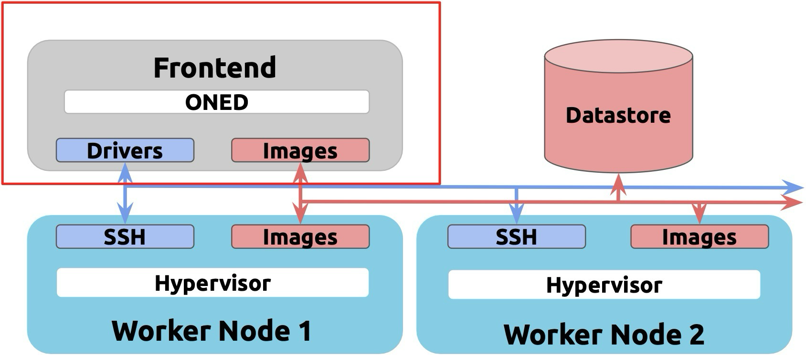

# Notes on OpenNebula

## Table of Contents

- [Notes on OpenNebula](#notes-on-opennebula)
  - [Table of Contents](#table-of-contents)
  - [Typical Architecture](#typical-architecture)
  - [Sunstone](#sunstone)
  - [Configuration](#configuration)
  - [CLI](#cli)
  - [Virtual Networks](#virtual-networks)
  - [Marketplace](#marketplace)
  - [Storage](#storage)
  - [Virtual Machines](#virtual-machines)
  - [Users, Groups and Permissions](#users-groups-and-permissions)

## Typical Architecture



## Sunstone

- Is the graphical user interface of OpenNebula;
- Responsible for serving the Web GUI, oned service, perform environment monitoring as well as management of network, storage or VMs
- Listens on 2616/tcp;
- Same website for admins and users, but has different views based on permissions;
- Each user can set SSH keys, 2FA and labels on his account;
- Labels can be used to categorize resources.
- Inspect `/var/log/one/oned.log` and `/var/log/one/monitor.log` log files in case there is an error in the frontend.

## Configuration

- To make sure the state of the cloud is persistent, OpenNebula will keep it stored in a SQL database;
- The options are SQLite (automatic), MariaDB and MySQL;
- This is configured on `/etc/one/oned.conf` at the host;
- During the installation of the software the system user `oneadmin` will be created. Services and CLI tools are going to be used by this user;
- During the first launch OpenNebula is going to create a Sunstone admin user for the deployment. Credentials are stored in a dedicated file `.one/one_auth`;
- We must configure hosts that are going to run the VMs before adding them to a OpenNebula cluster and provide them with monitoring and virtualization drivers;
- To configure the host we must add the OpenNebula repo, install `opennebula-node-kvm` and configure passwordless ssh connection from the Sunstone node to the host and vice versa;
- Then on the Sunstone section `Infrastructure/Hosts`, add a KVM host by putting its IP;
- Through the CLI:

```bash
sudo -i -u oneadmin

onehost create 'node2.dev.corp' -i kvm -v kvm

onehost show 1
```

## CLI

- `oneuser`: Manage Users
- `oneimage`: Manage Images
- `onegroup`: Manage Groups
- `onetemplate`: Manage Templates
- `oneacl`: Manage ACLs
- `oneacct`: Accounting Tool
- `onehost`: Manage Hosts
- `onemarket`: Marketplace Tool
- `onecluster`: Manage Clusters
- `onedb`: DB Tool
- `onevnet`: Manage Networks
- `oneflow`: Manage flows (services)
- `onedatastore`: Manage Datastores
- `onemarketapp`: Import marketapps
- `oneshowback`: Showback
- `onevrouter`: Manage virtual routers
- `onevdc`: Manage VDCs
- `onesecgroup`: Manage sec. groups
- `onevcenter`: Import vCenter resources
- `oneprovision`: Manage provisions
- `onecfg`: Manage configuration files
- `oneprovider`: Manage providers
- `onezone`: Manage zones onehook Manage hooks

Flags to output in a machine-readable format:

- `-j` for JSON
- `-x` for XML
- `-y` for YAML

## Virtual Networks

- Can be created under the Networks section of Sunstone;
- Can be a `Bridge`, `Open vSwitch`, `VXLAN`, etc;
- On the `Addresses` tab, we can set the IP range of that network;
- On the `Context` tab, we can set gateway, DNS and IP assignment method (DHCP or static);
- On the `Virtual Network` subsection, we can make a reservation on a certain network, meaning a portion of the network is going to be locked and available only to specific resources. The network is partitioned by IP address;
- On the `Lease` tab, we can also hold a specific IP address on a virtual network, so it cannot be used nor reserved;
- The `Network Templates` section can be used to speed the creation of new virtual networks;
- We can use the CLI as such: `onevnet create <path/to/file>` where file is a textfile containing parameters;

## Marketplace

- Is the repository of pre-build images, VM templates and service templates;
- Can be public or private;
- The public marketplace contains ready-to-use images;
- These images are based on the vanilla ISOs, but with virtualization packages;
- The different marketplaces configured are found under the `Storage` section, `Marketplaces` subsection;
- The `Apps` subsection contains all images available to the user;

## Storage

- We don't create a VM based on an image, but rather on a template. The template points to an image;
- Multiple VM templates can use the same image;
- The `Images` subsection contains the downloaded images ready to be used, as well as system snapshots, which are considered an image;
- A `datastore` is the location where files are saved. It can be:
- `Images Datastore`, which stores the base operating system images, persistent
data volumes, CD-ROMs.
- `System Datastore` holds disks of running Virtual Machines. Disk are moved
from/to the Images when the VMs are deployed/terminated.
- `Files & Kernels Datastore` to store plain files (not disk images), e.g. kernels,
ramdisks, or contextualization files.
- Create a new datastore at `Storage/Datastores` on Sunstone;
- Or use the CLI `onedatastore create <path/to/file>` where file is a textfile containing parameters;
- `Services` are images that contain an app (such as Wordpress) along with an OS. They are also stored on a datastore.

## Virtual Machines

- Currently instantiated VMs can be found at `Instances/VMs` on Sunstone or queried through the CLI with `onevm`;
- `VM Templates` are a textual representation of a VM;
- It contains pointers to images, parameters and other configurations;
- Some of those can be adjusted only by the administrator;
- Services also rely on VM Templates;
- VM Templates can be edited on the `Templates` section or queried through the CLI with `onetemplate`;
- VMs can be deployed alone or in batches;
- VMs can be accessed from Sunstone via VNC;
- VMs can be backed up or turned into an Image;
- We can make a snapshot of the VM's disk or of the entire VM;
- Restoring a disk snapshot is only possible with the VM powered down;
- Restoring a VM snapshot is possible at any time;
- VM configuration can be changed while it is running. It'll go into a hotplug state to apply the changes;
- VMs can be deployed through the CLI `onevm create --cpu 1 --memory 1024 --disk 2 --nic 5`;

## Users, Groups and Permissions

- Permissions exists for `owners`, `groups` and `others`;
- The levels are `use`, `manage` and `admin`;
- `Use` is for operations that do not modify the resource, `manage` for the ones that modify and `admin` for high responsability modifications;
- Each user is going to be attached to at least one group;
- Each group may have a separate group administrator. Group administrators are delegated with permissions to manage groups resources and add new users;
- By default, OpenNebula has two groups - `oneadmin` and `users`;
- By default, OpenNebula also going to have two users - oneadmin (if one_auth wasn't altered) and serveradmin(service user used for internal purposes);
- Groups can be created at `System/Groups`on Sunstone or through the CLI `onegroup create --name ops --admin_user ops-admin --admin_password 'Pa$$w0rd'`;
- can be created at `System/Users`on Sunstone or through the CLI `oneuser create basic_user 'Pa$$w0rd' --group 102`;
